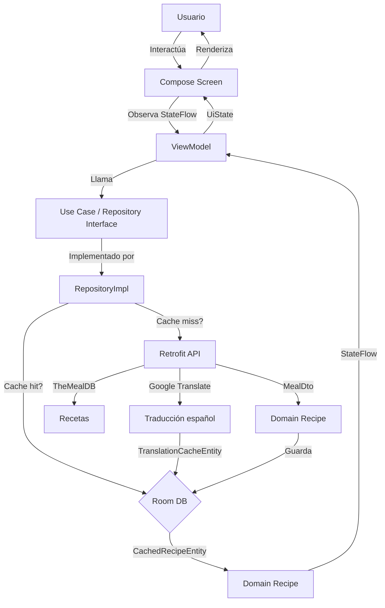

# Arquitectura — Sabores de Colombia

## Descripción de Capas

El proyecto sigue **Clean Architecture** con 4 capas bien definidas, implementando el patrón **MVVM** en la capa de presentación.

---

### 1. UI Layer (Presentación)

**Ubicación:** `feature/*/` + `ui/theme/`

| Componente | Responsabilidad |
|---|---|
| `Screen.kt` | Composable que renderiza la UI usando Jetpack Compose + Material 3 |
| `ViewModel.kt` | Maneja el estado de la UI mediante `StateFlow`, expone `UiState` |
| `Theme.kt` | Configuración de Material 3 con colores corporativos |
| `NavGraph` | Define las rutas de navegación (`NavHost` con `NavController`) |

**Regla:** Cada pantalla (feature) tiene su propio `Screen` + `ViewModel`. El ViewModel no conoce la UI; solo expone estado.

---

### 2. Domain Layer (Dominio)

**Ubicación:** `core/domain/`

| Componente | Responsabilidad |
|---|---|
| `model/Recipe.kt` | Entidad de dominio pura, sin anotaciones de Room ni Retrofit |
| `repository/*.kt` | Interfaces que definen el contrato de datos (`RecipeRepository`, `FavoritesRepository`) |
| `usecase/*.kt` | Casos de uso que orquestan la lógica de negocio (`RecipeTranslator`, `InitializeAppUseCase`) |

**Regla:** Esta capa NO depende de Android, Room, Retrofit ni ninguna biblioteca externa. Es Kotlin puro.

---

### 3. Data Layer (Datos)

**Ubicación:** `core/data/`

| Componente | Responsabilidad |
|---|---|
| `remote/` | Retrofit API services (`MealApiService`, `TranslationApiService`) + DTOs |
| `local/` | Room Database, DAOs, Entities (`CachedRecipeEntity`, `RecipeFavoriteEntity`, `TranslationCacheEntity`) |
| `mapper/` | Conversión entre DTO ↔ Domain ↔ Entity (`RecipeMapper`) |
| `repository/` | Implementaciones concretas de las interfaces del dominio |

**Regla:** Los repositorios implementan las interfaces del dominio. Pueden elegir entre Room (caché local) o API (remoto) según disponibilidad.

---

### 4. DI Layer (Inyección de Dependencias)

**Ubicación:** `di/`

| Módulo | Provee |
|---|---|
| `AppModule` | `OkHttpClient`, `Retrofit` (TheMealDB), `Retrofit` (Google Translate), `MealApiService`, `TranslationApiService` |
| `DatabaseModule` | `AppDatabase` (Room), `RecipeFavoriteDao`, `TranslationCacheDao`, `CachedRecipeDao` |
| `RepositoryModule` | Bindings: `RecipeRepositoryImpl` → `RecipeRepository`, `FavoritesRepositoryImpl` → `FavoritesRepository` |

**Regla:** Hilt gestiona el ciclo de vida de todos los objetos (`@Singleton`). Los ViewModels obtienen dependencias vía `@HiltViewModel` + `@Inject constructor`.

---

## Flujo de Datos



---

## Flujo Simplificado

```
UI (Compose Screen)
  ↓ observa StateFlow
ViewModel (HiltViewModel)
  ↓ llama a
Repository Interface (Domain)
  ↓ implementado por
Repository Implementation (Data)
  ↓ decide fuente
API (Retrofit) ←→ Room (SQLite)
```

---

## Estructura de Directorios

```
SaboresDeColombia/
├── app/
│   ├── build.gradle.kts
│   └── src/
│       ├── main/
│       │   ├── AndroidManifest.xml
│       │   ├── java/com/lab/saboresdecolombia/
│       │   │   ├── MainActivity.kt
│       │   │   ├── SaboresDeColombiaApp.kt
│       │   │   ├── di/
│       │   │   │   ├── AppModule.kt
│       │   │   │   ├── DatabaseModule.kt
│       │   │   │   └── RepositoryModule.kt
│       │   │   ├── navigation/
│       │   │   │   ├── NavRoutes.kt
│       │   │   │   └── AppNavGraph.kt
│       │   │   ├── core/
│       │   │   │   ├── domain/
│       │   │   │   │   ├── model/Recipe.kt
│       │   │   │   │   ├── repository/
│       │   │   │   │   │   ├── RecipeRepository.kt
│       │   │   │   │   │   └── FavoritesRepository.kt
│       │   │   │   │   └── usecase/
│       │   │   │   │       ├── RecipeTranslator.kt
│       │   │   │   │       └── InitializeAppUseCase.kt
│       │   │   │   └── data/
│       │   │   │       ├── local/
│       │   │   │       │   ├── AppDatabase.kt
│       │   │   │       │   ├── dao/ (3 DAOs)
│       │   │   │       │   └── entity/ (3 Entities)
│       │   │   │       ├── remote/
│       │   │   │       │   ├── MealApiService.kt
│       │   │   │       │   ├── TranslationApiService.kt
│       │   │   │       │   └── dto/ (2 DTOs)
│       │   │   │       ├── mapper/RecipeMapper.kt
│       │   │   │       └── repository/ (2 Implementations)
│       │   │   ├── feature/
│       │   │   │   ├── splash/
│       │   │   │   ├── home/
│       │   │   │   ├── allrecipes/
│       │   │   │   ├── regionlist/
│       │   │   │   ├── detail/
│       │   │   │   ├── search/
│       │   │   │   └── favorites/
│       │   │   └── ui/theme/ (Color, Type, Theme)
│       │   └── res/ (XML resources, icons)
│       └── test/ / androidTest/
├── gradle/
│   └── libs.versions.toml
├── build.gradle.kts
├── settings.gradle.kts
├── gradle.properties
├── local.properties
├── .github/workflows/ci.yml
└── README.md
```

---

## Convenciones de Nomenclatura

| Tipo | Convención | Ejemplo |
|---|---|---|
| Screen | `<Feature>Screen.kt` | `HomeScreen.kt` |
| ViewModel | `<Feature>ViewModel.kt` | `HomeViewModel.kt` |
| UiState | `<Feature>UiState` | `HomeUiState` |
| Repository (interface) | `<Dominio>Repository` | `RecipeRepository` |
| Repository (impl) | `<Dominio>RepositoryImpl` | `RecipeRepositoryImpl` |
| Entity (Room) | `<Nombre>Entity` | `CachedRecipeEntity` |
| DAO | `<Nombre>Dao` | `RecipeFavoriteDao` |
| DTO | `<Nombre>Dto` / `<Nombre>Response` | `MealDto`, `MealListResponse` |
| Use Case | `<Acción>UseCase` | `InitializeAppUseCase` |
| Mapper | `<Origen>Mapper` | `RecipeMapper` |
| Module | `<Capa>Module` | `AppModule` |
| NavRoute | `UPPER_SNAKE` | `REGION_LIST`, `ALL_RECIPES` |
